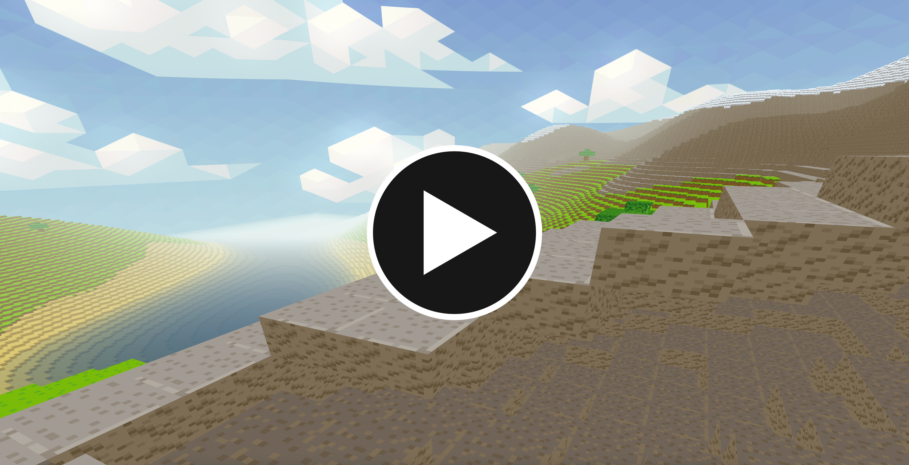
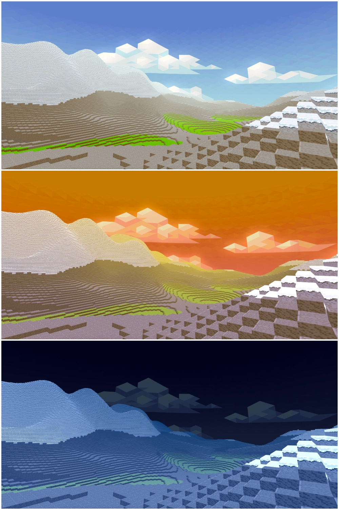
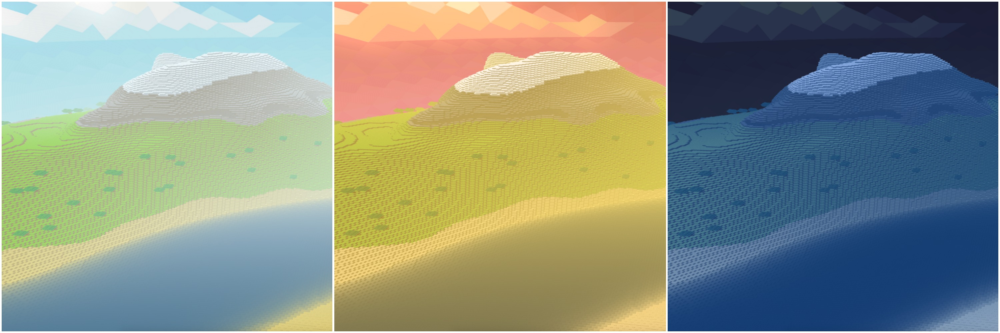
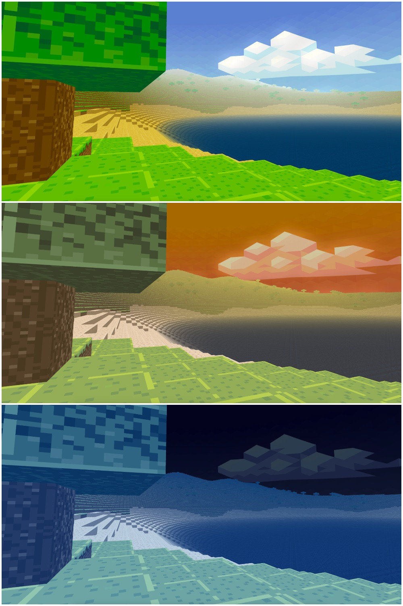
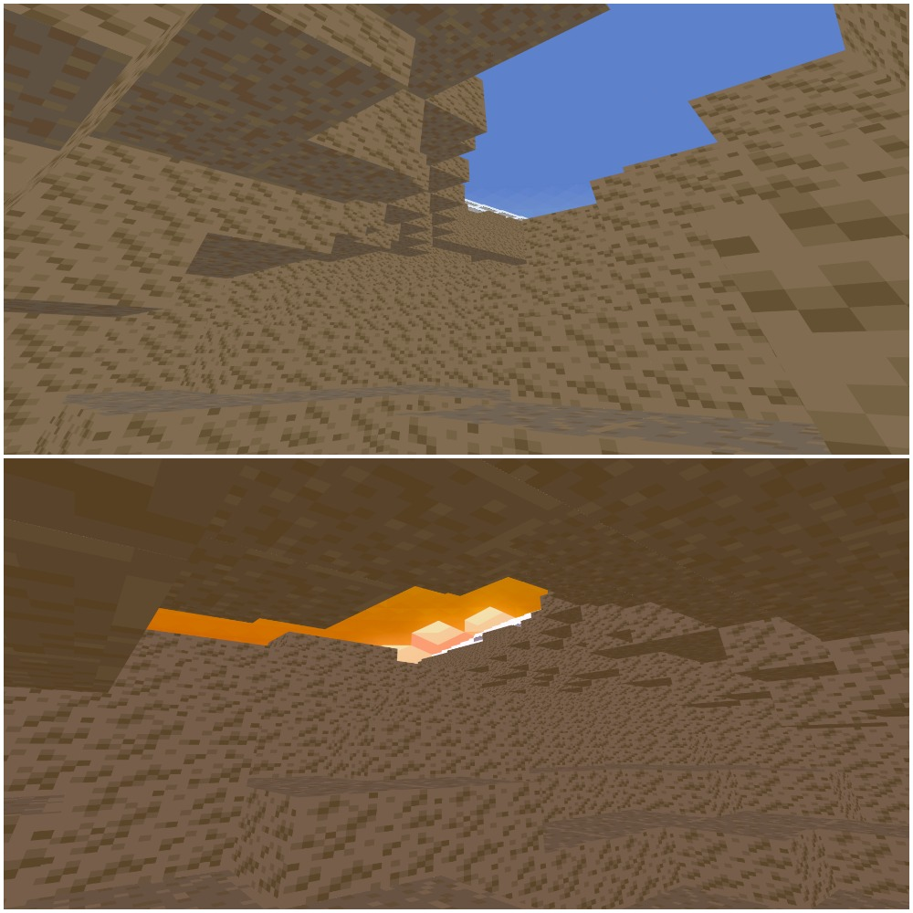

# VoxelWorld

A fully procedural world rendered using OpenGl

## Showcase Video
[](https://www.youtube.com/watch?v=1Bxgr2ItPq4 "Voxel Video")

## Comiling and Running

Make sure to check out the options bellow before running.

Run `make` to compile. An executable will be created.

Run with:
```
./nPuzzle boards/[board]
```

For randomly generated maps, run:
```
python puzzle_generator.py -s [size] > tmp; ./nPuzzle tmp
```

## Options

`-v` run visualizer

`-g` greedy mode

`-m` multiplier mode (recomended)

 `-u` uniform mode

## Input (visualizer only)

Space : pause.

Right arrow : next.

1-4 : switch picture (egg is best ^^)

## Screenshots









